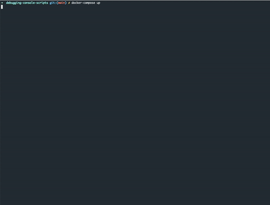

# debugging console_scripts running in container.

This example helps to debug console scripts created using python. 
I have used [debugpy](https://github.com/microsoft/debugpy) for debugging purpose.

Suppose we have command to run which creates directory.
```bash
$ testcli create -n testdir
```

## steps to debug

1. Add debugpy code in the main file.
```python
import debugpy
debugpy.listen(("0.0.0.0", 5678))
debugpy.wait_for_client() # waits for vscode to attach
```

Install python packages locally in your virtual environment. 
```bash
$ pip install -e .
```

2. Update command for debugging in `docker-compose.yaml`. You can also update environment variables defined in `.env` file.
```yaml
command: ["testcli create -n testdir"]
```

3. Start docker-compose
```bash
$ docker-compose up
```

4. Add breakpoint in your code for debugging. 

5. Click `Run and Debug` in Visual Studio Code Editor. Click create a launch.json file.
   Now click Python and select Remote Attach. Accept default host and port. Ensure that pathMappings are correct.
 
6. To debug Select `Python: Remote Attach`.  

